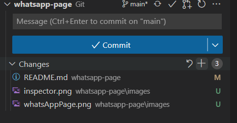

# Login Form

Here you will learn to create a Login Form and send the credentials

## Steps

- Clone this repo:
    - click the green Code button in github, copy the URL
    - open the Visual Studio Code in your learning folder and and write in terminal `git clone <paste_your_url_here>`
- create a separate branch `git switch -c "dev"`
- add html and css files and code
- in VS Code, click on html file and Go Live (plugin installed previously) to avoid refreshing the page on changes
- when you're done coding, add the changes to staging using + button in VS Code Source Control tab or type on terminal `git add .`
 
- commit and push the code `git commit -am "commit message here"`, `git push -u origin dev`
- go to github and raise a pull request from your development branch to master
 

## Requirements

- create a login form with email & password fields and Submit button and send the credentials in two ways:
1. using the \<form> element with action and method attributes https://developer.mozilla.org/en-US/docs/Learn/Forms/Sending_and_retrieving_form_data
2. without the \<form> element, get the input fields values and send them using the fetch API https://developer.mozilla.org/en-US/docs/Web/API/Fetch_API/Using_Fetch or keep the \<form> element and use `preventDefault()` on form submit event listner
- email & password fields must be required and Submit button should not function if either or both fields are empty.
- create two separate html files (i.e. form.html and fetch.html) but only one style.css which will be reused (do not duplicate styles) 
- center the email & password fields and Submit button using flex 
- if you need to upload images to your repo, place them all inside the images folder
- use English everywhere (page, variables naming, comments, commit messages)

